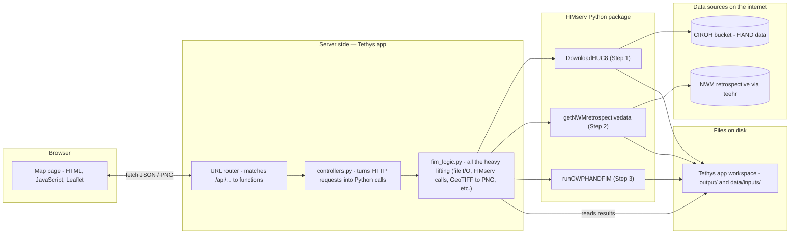

# FIMserve Viewer

**A web app that draws flood maps for any US watershed, for any past date.**

Open the app in a browser, click on a watershed, pick a date — and a few minutes later you'll
see exactly which areas would have been under water. You can also download the result as a
GIS file to use in QGIS / ArcGIS.

This app is a web wrapper around [FIMserv](https://github.com/sdmlua/FIMserv), which itself
wraps [NOAA's flood inundation model (HAND-FIM)](https://github.com/NOAA-OWP/inundation-mapping).
It runs on the [Tethys Platform](https://www.tethysplatform.org), which is a free, open-source
framework for hydrology web apps.

> **In one sentence:** click watershed → pick date → see flood extent on a map.

---

## What you'll see

When the app is running you get a full-screen Leaflet map. The contiguous US is divided
into ~2,500 small "HUC8" watersheds (HUC = Hydrologic Unit Code; HUC8 means the level-8
naming, roughly the size of a county). Click any one of them, pick a date in the right-hand
sidebar, and the app will:

1. Download terrain and channel data for that watershed.
2. Look up streamflow on that date from the National Water Model (NWM).
3. Compute which pixels would have been flooded.
4. Draw the flooded area as a blue overlay on the map.

You can also:

- Toggle **discharge labels** on each river reach (so you can see "this stream was flowing
  at 91 cfs at that moment").
- Switch the labels between metric (m³/s) and imperial (ft³/s = "cfs") units.
- Click **Download processed (reclassified)** to save a GIS-ready GeoTIFF where flooded
  pixels = 1, dry pixels = 0, and outside-the-domain pixels = NoData.

---

## Some plain-language jargon, just so the rest of this README makes sense

| Term | Plain English |
|------|---------------|
| **HUC8** | A small US watershed (~county-sized). The app shows ~2,500 of them. Each has an 8-digit ID like `06010105`. |
| **NWM** (National Water Model) | NOAA's continuous river-flow forecast/historical record covering every stream in the US. We use the **retrospective** version (1979 – present). |
| **Discharge / streamflow** | How much water is flowing past a point per second. Measured in m³/s or ft³/s (cfs). |
| **Stage** | How high the water level is in the channel, in metres above the channel bottom. |
| **HAND** (Height Above Nearest Drainage) | A terrain layer that says, for every pixel: "you are X metres above the nearest river." Used to decide if a pixel floods at a given stage. |
| **HAND-FIM** | The flood-inundation model that combines HAND + a per-reach discharge → stage table to produce a flooded-yes/no raster. |
| **Hydrotable** | A pre-made lookup table for each river reach: "if discharge is X, stage is Y." |
| **FIMserv** | A Python package that wraps NOAA's HAND-FIM and the data download steps. This app calls into FIMserv. |
| **Tethys Platform** | The web framework this app runs on. Think "Django + ready-made hydrology UI." |
| **GeoTIFF / .tif** | A raster image file with geographic coordinates. Opens in QGIS or any GIS tool. |
| **GeoJSON** | A JSON file format for geographic shapes (points, lines, polygons). |

---

## Quickstart (for people who've never used Tethys before)

### What you'll need

- A Mac or Linux machine. (Windows works but the commands are a bit different.)
- About 5 GB of free disk space.
- A reasonably fast internet connection (the model data is big).
- 30–60 minutes of patience the first time you set this up.

### Step 1 — Install conda (or mamba)

`conda` and its faster cousin `mamba` are package managers for Python. They let us create
isolated "environments" so installing this app doesn't break any other Python you have.

If you don't already have it, install **Miniforge** (a slim conda that uses conda-forge by
default):

> <https://github.com/conda-forge/miniforge#install>

After installing, close and reopen your terminal so the `conda` command is available.

### Step 2 — Create a Tethys environment and install Tethys Platform

In your terminal, paste these one at a time:

```bash
mamba create -n tethys -c conda-forge "tethys-platform>=4.0" "postgresql"
```

That makes a new environment called `tethys` and installs Tethys + a database into it.
This takes a few minutes.

```bash
conda activate tethys
```

Your prompt should now show `(tethys)` at the start — that means you're "inside" the new
environment.

### Step 3 — One-time database setup

Tethys uses a small local database (PostgreSQL) to keep track of which apps are installed
and who the users are. You only do this once:

```bash
tethys gen portal_config
tethys db init
tethys db start
tethys db configure
```

That's literally just "make a config file, create the database, start it, set it up."
You'll be asked to create an `admin` user near the end — pick any username + password,
just remember them.

### Step 4 — Get this app

```bash
git clone https://github.com/tasfia26/tethysapp-fimserve_viewer.git
cd tethysapp-fimserve_viewer
```

### Step 5 — Install the app's dependencies

```bash
tethys install -d
```

This is the slow one — 5 to 15 minutes depending on your internet. It reads `install.yml`,
downloads everything the app needs (geopandas, rasterio, leaflet, NOAA's flood model, etc.),
and registers the app with Tethys. You can go make tea.

### Step 6 — Start the web server

```bash
tethys start -p 127.0.0.1:8001
```

You should see something like:

```
Starting ASGI/Daphne version 4.2.1 development server at http://127.0.0.1:8001/
```

Leave that terminal alone — that's your server. To stop it later, press **Ctrl+C** in
that window.

### Step 7 — Open the app

In your browser, go to:

> **<http://127.0.0.1:8001/apps/fimserve-viewer/>**

You should see the map. Pan around, click a HUC8 polygon — you're done.

### Step 8 — Try generating your first flood map

1. Click any HUC8 polygon (try `06010105` — Upper Tennessee — for a quick test).
2. In the sidebar, set **Date** to something like `2022-04-27`, **Time** to `12:00:00`.
3. Click **Generate Flood Map**.
4. Wait. The first time for any given watershed takes 5–15 minutes because the app has
   to download terrain data. Subsequent generations of the same watershed are fast (~1 min).
5. When it's done you'll get a green "splash!" success message.
6. Click **Show on map** — the flooded area appears in blue.
7. Toggle **Show discharge numbers on map** — labels appear on each river segment.

---

## How a flood map is actually computed (visual)

Here's what happens behind the scenes when you click **Generate Flood Map**. The diagram
reads top-to-bottom; each box is one thing the server does, in order:

```mermaid
flowchart TD
    User([You click 'Generate Flood Map']):::user

    subgraph S1["Step 1 — Download watershed data"]
        direction TB
        T1["Server asks FIMserv: get HAND data for this HUC8"]
        Cloud1[("CIROH cloud bucket - pre-computed HAND for every US watershed")]
        Files1["Saves locally: terrain heights, discharge-to-stage lookup table, river segment shapes"]
        T1 --> Cloud1 --> Files1
    end

    subgraph S2["Step 2 — Get streamflow for your date"]
        direction TB
        T2["Server asks NWM: streamflow on this date for every river segment in this HUC8"]
        Cloud2[("National Water Model - retrospective archive 1979 to today")]
        Files2["Saves locally: one discharge value per river segment as a CSV"]
        T2 --> Cloud2 --> Files2
    end

    subgraph S3["Step 3 — Compute the flood map"]
        direction TB
        T3a["For each river segment: look up its discharge"]
        T3b["Look up the matching stage from the hydrotable"]
        T3c["Mark every pixel where HAND height is less than or equal to stage as FLOODED"]
        Files3["Output: a GeoTIFF where each pixel = flooded or dry"]
        T3a --> T3b --> T3c --> Files3
    end

    Display["Server sends a PNG preview to the browser"]:::out
    Map([Flooded area appears in blue on the Leaflet map]):::user

    User --> S1
    S1 --> S2
    S2 --> S3
    S3 --> Display
    Display --> Map

    classDef user fill:#dbeafe,stroke:#1d4ed8,color:#1e3a8a
    classDef out fill:#dcfce7,stroke:#15803d,color:#14532d
```



### The intuition behind step 3 (the actual physics)

Imagine a single river segment in your watershed. We know two things about it:

1. **How much water is in it right now** (from the NWM — the "discharge" in m³/s).
2. **A lookup table** that says: if discharge is X, the water surface is Y metres above
   the channel bottom (the "stage"). This table was pre-computed by NOAA from the
   channel's geometry + Manning's equation.

So we do `discharge → stage`. Now we have a number: "the water is, say, 2.3 metres above
the channel here."

Then we look at the HAND raster for the area around that segment. The HAND raster says,
for every pixel: "you are X metres above the nearest river." So if a pixel says "I am
1.8 metres above the river," and the water is at 2.3 metres, then that pixel is **0.5 m
underwater** → it's flooded.

We do that for every river segment in the HUC8 and stitch the results together. That's
the flood map.

---

## How the app is put together (architecture)

If you're going to modify the code, here's the big picture:



In short: **JavaScript talks to Python via HTTP, Python calls FIMserv, FIMserv pulls cloud
data and produces files, Python reads those files back and sends preview images / GeoJSON
to JavaScript.**

---

## Where files live in this repo

```
tethysapp-fimserve_viewer/
│
├── README.md                  ← you are here
├── install.yml                ← list of Python packages the app needs
├── post_install.py            ← installs FIMserv after the rest is in place
├── pyproject.toml             ← packaging metadata (mostly empty on purpose)
├── .gitignore                 ← what NOT to commit (model outputs, etc.)
│
└── tethysapp/
    └── fimserve_viewer/
        │
        ├── app.py             ← the app's name, color, URL prefix
        ├── controllers.py     ← every API endpoint (one Python function per URL)
        ├── fim_logic.py       ← all the helper code: file lookups, FIMserv calls,
        │                        reclassification, image generation
        │
        ├── public/            ← static files served as-is
        │   ├── css/main.css   ← all the styling
        │   ├── js/main.js     ← all the JavaScript (Leaflet + UI)
        │   └── images/        ← logos, icon
        │
        ├── resources/
        │   └── all_huc8.geojson  ← bundled HUC8 boundary file (~57 MB)
        │
        ├── templates/
        │   └── fimserve_viewer/
        │       ├── base.html  ← Tethys page skeleton
        │       └── home.html  ← the actual map page
        │
        └── tests/
```

If you want to change something:

| What you want to change             | File to edit                                 |
|-------------------------------------|----------------------------------------------|
| The page layout / sidebar / modals  | `templates/fimserve_viewer/home.html`        |
| Colours, fonts, sizes               | `public/css/main.css`                        |
| Map behaviour, button click logic   | `public/js/main.js`                          |
| What an API endpoint returns        | `controllers.py`                             |
| How the flood map is computed       | `fim_logic.py`                               |
| What gets installed                 | `install.yml`                                |
| The app's display name / colour     | `app.py`                                     |

---

## API endpoints (what the JavaScript talks to)

You don't need this unless you're writing your own client. All endpoints live under
`/apps/fimserve-viewer/`.

| What it does                              | URL |
|-------------------------------------------|-----|
| Health check                              | `GET /api/health/` |
| HUC8 boundary GeoJSON                     | `GET /api/all-huc8-geojson/` |
| Run all 3 steps in one go                 | `POST /api/generate-flood-map/` |
| Run **one** step (1, 2, or 3)             | `POST /api/generate-flood-map/step/{step}/` |
| Run with a custom (user-supplied) discharge | `POST /api/generate-flood-map-custom/` |
| Get a PNG preview of an NWM flood map     | `GET /api/flood-map-preview/nwm/{huc8}/{date}` |
| Get a PNG preview of a custom flood map   | `GET /api/flood-map-preview/custom/{huc8}/{q}` |
| Get per-reach discharge labels (GeoJSON)  | `GET /api/flood-q-labels/nwm/{huc8}/{date}` |
| Download an NWM flood-map .tif            | `GET /api/get-flood-map/{huc8}/{date}?reclass=0\|1` |
| Download a custom-discharge flood-map .tif| `GET /api/get-flood-map-custom/{huc8}/{q}?reclass=0\|1` |
| Get a hydrograph (time series)            | `GET /api/get-hydrograph/{huc8}/{date}` |

POST bodies are JSON like:

```json
{ "huc8": "06010105", "date": "2022-04-27", "time": "12:00:00" }
```

---

## What the "reclassified" download actually does

The raw flood map from NOAA's model is a GeoTIFF where each pixel is an integer "HydroID":

- **positive integer** → flooded by river segment with that HydroID
- **0 or negative** → modelled but not flooded
- **NoData (`-9999`)** → outside the modelled area

That's great for traceability ("which segment caused this flooding?") but bad for normal
GIS use. The **Download processed (reclassified)** button collapses it into:

- **1** → flooded
- **0** → dry (model said so)
- **NoData** → outside the model's coverage (we don't know — *not* the same as "dry")

The collapse is done with a tiny rule table in `fim_logic.py`:

```python
DEFAULT_RECLASS_TABLE = [
    (-999_999_999, 0, 0),       # any HydroID ≤ 0 → 0 (dry)
    (0, 2_147_483_647, 1),      # any HydroID > 0 → 1 (flooded)
]
```

We deliberately keep NoData distinct from 0 so users can tell apart "dry" from
"unknown."

---

## Frequently asked questions

### Why did my first flood map take 10 minutes but the second only took 1?

The first time you generate a map for a watershed, the app downloads ~hundreds of MB of
terrain + channel data from the cloud. Once it's on your disk, it's reused. So:

- First generation in a watershed = slow (download dominates).
- Second generation in the same watershed = fast (just NWM streamflow + the inundation calc).

### Why does some river segment show "104 cfs" but no flooded area, while another nearby shows "92 cfs" with a big flood?

Because rivers have different sizes. A small creek that handles 50 cfs in-channel will
overflow at 92 cfs, whereas a larger river can carry 104 cfs entirely within its banks.
The model uses each segment's individual channel geometry — so the flooding-vs-discharge
relationship is different for every river. This is correct behaviour, not a bug.

### Where do the model outputs end up on my computer?

By default, inside the Tethys app's workspace:

```
~/.../tethysapp-fimserve_viewer/tethysapp/fimserve_viewer/workspaces/app_workspace/
   ├── code/inundation-mapping/      ← NOAA's model code (cloned at first run)
   ├── data/inputs/                  ← NWM streamflow CSVs
   └── output/flood_<HUC8>/          ← terrain + flood map .tif files
```

If you want them somewhere else, set the environment variable `FIMSERV_ROOT`
**before** starting the portal:

```bash
export FIMSERV_ROOT=/somewhere/with/lots/of/space
tethys start -p 127.0.0.1:8001
```

### I edited a Python file and nothing changed.

Python code (`controllers.py`, `fim_logic.py`) does NOT auto-reload. Press Ctrl+C in the
terminal where the server is running, then run `tethys start -p 127.0.0.1:8001` again.

CSS, JavaScript, and HTML files DO auto-reload — just hard-refresh your browser
(Cmd+Shift+R / Ctrl+Shift+R).

### I'm getting "command not found: tethys".

You probably forgot `conda activate tethys`. Your prompt should start with `(tethys)`.

### Apps Library page crashes with "X is not a registered namespace".

That means there's a leftover registration in the database from an app you used to have
installed but no longer do. Open a new terminal, then:

```bash
conda activate tethys
tethys manage shell -c "from tethys_apps.models import TethysApp; TethysApp.objects.exclude(package='fimserve_viewer').delete()"
```

That keeps `fimserve_viewer` and removes orphans. Restart the portal after.

### Can I host this somewhere public?

Yes — Tethys runs anywhere Django + Daphne run. For production you'd want a real
PostgreSQL instance, a real ASGI server (the included Daphne is fine but small), HTTPS,
and you should set proper CSRF tokens on the API instead of using `@csrf_exempt`. That's
beyond this README.

---

## Acknowledgements

- **[NOAA-OWP](https://github.com/NOAA-OWP/inundation-mapping)** — for the open-source
  HAND-FIM flood-inundation model.
- **[CIROH](https://ciroh.ua.edu/)** — for hosting the pre-computed HAND data on a free
  S3 bucket.
- **[FIMserv](https://github.com/sdmlua/FIMserv)** (Surface Dynamics Modeling Lab,
  University of Alabama) — the Python wrapper around HAND-FIM that this app calls.
- **[Tethys Platform](https://www.tethysplatform.org)** (Brigham Young University) — the
  web framework.
- **[teehr](https://github.com/RTIInternational/teehr)** — for retrospective NWM access.

---

## License

This app is a port of an existing Flask viewer; it follows the licensing of its upstream
dependencies. See FIMserv, NOAA-OWP, and Tethys Platform for their respective licenses.
